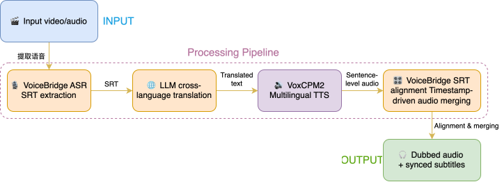

# VoiceGate: Cross-Language Video Dubbing Engine


[中文文档](README_zh.md)

> A cross-language video translation & dubbing pipeline powered by VoxCPM2 and ComfyUI

## Overview

VoiceGate is a cross-language video dubbing engine built on VoxCPM2 and ComfyUI. VoxCPM2 supports **30 languages** (including 8 Southeast Asian languages) and **9 Chinese dialects** (Cantonese, Sichuanese, Wu, Northeastern, Hokkien, etc.), with voice cloning and timbre design capabilities. The engine achieves frame-level alignment between TTS audio and SRT subtitle timestamps via the custom-built **VoiceBridge** plugin, ensuring dubbing stays perfectly in sync with the video.

The complete pipeline covers ASR subtitle extraction, LLM translation, multilingual TTS, and synchronized audio merging — all visually orchestrated as a drag-and-drop node graph, ready to use out of the box.

[Watch the demo on Bilibili (Chinese)](https://www.bilibili.com/video/BV1sc7C6VE9e/?share_source=copy_web&vd_source=94a8c00ee32b6b955ae0133d5103f92a)

## Use Cases

- **Content Going Global** — One-click dubbing of Chinese educational/knowledge videos into English, Japanese, Korean, etc., for publishing on YouTube/TikTok
- **Content Importing** — Dubbing overseas YouTube/Bilibili content into Chinese or regional dialects for the domestic market
- **Multilingual Localization** — Producing multi-language versions of documentaries, museum guides, and educational materials

## Architecture



### Core Modules

| Module | Description |
|--------|-------------|
| VoiceBridge ASR | Speech-to-subtitle via Qwen3-ASR with forced alignment |
| LLM Translation | Subtitle translation with customizable prompt & model |
| VoxCPM2 TTS | 30 languages + 9 dialects, voice cloning & timbre design |
| VoiceBridge SRT Alignment | Frame-level merging of TTS audio with SRT timestamps |
| MelBandRoFormer | Vocal separation with optional ambient sound preservation |

## Key Innovation

The **VoiceBridge plugin** ([GitHub](https://github.com/YanTianlong-01/comfyui_voicebridge)) is the core contribution of this project — the first to bring SRT-timestamp-driven multilingual TTS alignment into ComfyUI's visual workflow:

- `VoiceBridgeAudioListMergerBySRT` — Merges per-sentence TTS audio strictly aligned to subtitle timelines
- `VoiceBridgeSRTSplitter` — Splits SRT subtitles by timestamp to drive per-sentence TTS generation
- `VoiceBridgeASRTranscribe` — ASR transcription with forced alignment, outputting time-stamped SRT
- Solves the classic "audio-video desync" pain point in AI dubbing, achieving frame-level synchronization

## Project Structure

```
VoiceGate/
├── comfyui_voicebridge/  # VoiceBridge ComfyUI plugin (git submodule)
├── workflows/             # ComfyUI workflow JSON files
├── README.md              # This file (English)
├── README_zh.md           # 中文文档 (Chinese documentation)
└── LICENSE
```

## Quick Start

### Option 1: Try Online (Recommended)

No local setup needed — just open in your browser:

👉 [Online Web (Recommended)](https://voicegate.netlify.app)

👉 [Online App (Audio)](https://www.runninghub.cn/ai-detail/2062442306350964737?inviteCode=rh-v1455)
👉 [Online App (Video)](https://www.runninghub.cn/ai-detail/2062446982618238978?inviteCode=rh-v1455)

👉 [ComfyUI Online Workflow (Audio)](https://www.runninghub.cn/post/2062432233125928961?inviteCode=rh-v1455)
👉 [ComfyUI Online Workflow (Video)](https://www.runninghub.cn/post/2062445363042283522?inviteCode=rh-v1455)


### Option 2: Local Deployment

> A CUDA-capable NVIDIA GPU is recommended. Use Python 3.12 for the best
> compatibility with the custom nodes used by this workflow. If you already
> have a working ComfyUI installation, keep it and start from step 2.

#### 1. Install ComfyUI and clone VoiceGate

```bash
mkdir VoiceGate-local && cd VoiceGate-local

git clone --recursive https://github.com/YanTianlong-01/VoiceGate.git
git clone https://github.com/comfyanonymous/ComfyUI.git

# macOS / Linux
python3.12 -m venv .venv
source .venv/bin/activate

# Windows PowerShell (run these two lines instead)
# py -3.12 -m venv .venv
# .venv\Scripts\Activate.ps1

python -m pip install --upgrade pip
python -m pip install -r ComfyUI/requirements.txt
```

Keep using the same Python environment for every command below. If you use
ComfyUI Portable, run dependency commands with its bundled
`python_embeded/python.exe` and skip virtual-environment creation.

#### 2. Install the required custom nodes

```bash
cd ComfyUI/custom_nodes

git clone https://github.com/YanTianlong-01/comfyui_voicebridge.git
git clone https://github.com/RH-RunningHub/ComfyUI_RH_VoxCPM.git
git clone https://github.com/kijai/ComfyUI-MelBandRoFormer.git
git clone https://github.com/ltdrdata/ComfyUI-Manager.git comfyui-manager

cd ..
python -m pip install -r custom_nodes/comfyui_voicebridge/requirements.txt
python -m pip install -r custom_nodes/ComfyUI_RH_VoxCPM/requirements.txt
python -m pip install -r custom_nodes/ComfyUI-MelBandRoFormer/requirements.txt
```

The workflow also uses several lightweight utility nodes. Start ComfyUI once,
load the workflow, then open **Manager → Install Missing Custom Nodes** and
install the remaining packages (for example rgthree, Easy Use, Comfyroll, and
AudioTools). Restart ComfyUI after installation.

#### 3. Download the models

```bash
python -m pip install --upgrade huggingface_hub

# VoxCPM2
hf download openbmb/VoxCPM2 \
  --local-dir models/voxcpm/VoxCPM2

# MelBandRoFormer (the workflow references this exact file)
hf download Kijai/MelBandRoFormer_comfy MelBandRoformer_fp32.safetensors \
  --local-dir models/diffusion_models/MelBandRoFormer_comfy
```

VoiceBridge downloads Qwen3-ASR and Qwen3-ForcedAligner automatically on first
use. They can also be placed manually under `ComfyUI/models/Qwen3-ASR/`.
For lower VRAM usage, you may download `MelBandRoformer_fp16.safetensors`
instead and select it in the MelBandRoFormer loader node.

#### 4. Start ComfyUI and load the workflow

```bash
python main.py
```

Open the URL printed in the terminal (normally `http://127.0.0.1:8188`), then
drag `VoiceGate/workflows/VoiceGate-Workflow.json` onto the canvas. Configure
the OpenAI-compatible API URL, model name, and API key in the LLM node; set the
target language in the `easy string` node (default is `English`); upload the
source audio and reference audio; then queue the workflow.

`VoiceGate-Workflow_api.json` is intended for ComfyUI API clients, not for
editing in the browser.

If a node is shown in red, use **Manager → Install Missing Custom Nodes** and
restart ComfyUI. If a model is missing, check that its directory matches the
path shown above and reselect it in the corresponding loader node.

## Dependencies

- ComfyUI
- VoxCPM2 (via ComfyUI_RH_VoxCPM nodes)
- Qwen3-ASR / Qwen3-ForcedAligner
- MelBandRoFormer

## License

Apache-2.0

## Acknowledgements

- [VoxCPM2](https://github.com/OpenBMB/VoxCPM) — OpenBMB's open-source multilingual TTS model
- [ComfyUI](https://github.com/comfyanonymous/ComfyUI) — Visual workflow engine
