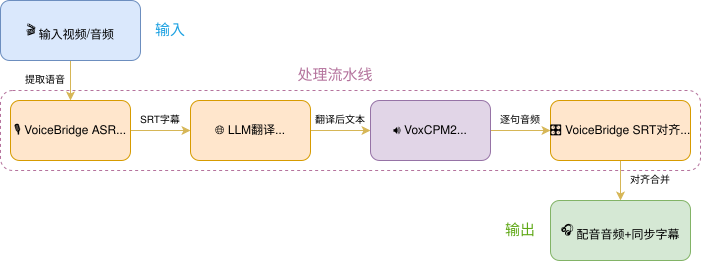

# VoiceGate：跨语言视频智能配音引擎

> 基于 VoxCPM2 与 ComfyUI 的跨语言视频翻译配音流水线

## 项目简介

VoiceGate 是基于 VoxCPM2 与 ComfyUI 构建的跨语言视频智能配音引擎。VoxCPM2 支持 30 种语言（含东南亚八国语言）与 9 种中文方言（粤语、四川话、吴语、东北话、闽南语等），具备声音克隆与音色设计能力。引擎通过自研 VoiceBridge 插件实现 TTS 语音与 SRT 字幕时间戳的帧级对齐，确保配音与画面精准同步。

完整链路覆盖 ASR 字幕提取、LLM 翻译、多语言 TTS 到音频对齐合并，节点图可视化编排，开箱即用。

[B站效果演示视频【VoiceGate：跨语言视频智能配音引擎】](https://www.bilibili.com/video/BV1sc7C6VE9e/?share_source=copy_web&vd_source=94a8c00ee32b6b955ae0133d5103f92a)

## 应用场景

- **内容出海**：中文知识类视频一键翻配为英文、日文、韩文等版本，发布到 YouTube/TikTok
- **视频引进**：海外 YouTube/B 站内容翻配为中文或方言版本，引进国内
- **多语言本地化**：纪录片、博物馆讲解、教育内容的多语言版本制作

## 技术架构



### 核心模块

| 模块 | 说明 |
|------|------|
| VoiceBridge ASR | 基于 Qwen3-ASR 的语音转字幕，支持 forced alignment |
| LLM 翻译 | 字幕翻译（支持自定义 prompt 与模型） |
| VoxCPM2 TTS | 30 语言 + 9 方言，声音克隆与音色设计 |
| VoiceBridge SRT 对齐 | TTS 语音与 SRT 时间戳帧级对齐合并 |
| MelBandRoFormer | 人声分离，支持保留环境音 |

## 核心创新

**VoiceBridge 插件**（[GitHub](https://github.com/YanTianlong-01/comfyui_voicebridge)）是本项目核心贡献，首次将 SRT 字幕时间戳驱动的多语言 TTS 对齐引入 ComfyUI 可视化工作流：

- `VoiceBridgeAudioListMergerBySRT`：TTS 生成的逐句音频严格按字幕时间轴合并
- `VoiceBridgeSRTSplitter`：SRT 字幕按时间戳拆分，驱动 TTS 逐句生成
- `VoiceBridgeASRTranscribe`：ASR 转录 + forced alignment，输出带时间戳的 SRT
- 解决传统 AI 配音"音画脱节"的痛点，实现配音与原片节奏帧级同步

## 项目结构

```
VoiceGate/
├── comfyui_voicebridge/  # VoiceBridge ComfyUI 插件 (git submodule)
├── workflows/             # ComfyUI 工作流 JSON
├── README.md              # English
├── README_zh.md           # 中文版本文档
└── LICENSE
```

## 快速开始

### 方式一：在线体验（推荐）

无需本地部署，直接在浏览器中开箱即用：

👉 [在线应用（音频版）](https://www.runninghub.cn/ai-detail/2062442306350964737?inviteCode=rh-v1455)
👉 [在线应用（视频版）](https://www.runninghub.cn/ai-detail/2062446982618238978?inviteCode=rh-v1455)

👉 [ComfyUI 在线工作流（音频版）](https://www.runninghub.cn/post/2062432233125928961?inviteCode=rh-v1455)
👉 [ComfyUI 在线工作流（视频版）](https://www.runninghub.cn/post/2062445363042283522?inviteCode=rh-v1455)

👉 [Huggingface 在线应用体验](https://huggingface.co/spaces/build-small-hackathon/VoiceGate)

打开链接 → 点击"立即运行" → 上传视频 → 选择目标语言 → 一键生成配音

### 方式二：本地部署

> 推荐使用支持 CUDA 的 NVIDIA 显卡。为兼容本工作流使用的自定义节点，建议使用
> Python 3.12。如果你已经有可正常运行的 ComfyUI，可以保留现有安装，直接从第 2
> 步开始。

#### 1. 安装 ComfyUI 并克隆 VoiceGate

```bash
mkdir VoiceGate-local && cd VoiceGate-local

git clone --recursive https://github.com/YanTianlong-01/VoiceGate.git
git clone https://github.com/comfyanonymous/ComfyUI.git

# macOS / Linux
python3.12 -m venv .venv
source .venv/bin/activate

# Windows PowerShell（改为执行下面两行）
# py -3.12 -m venv .venv
# .venv\Scripts\Activate.ps1

python -m pip install --upgrade pip
python -m pip install -r ComfyUI/requirements.txt
```

后续命令都要使用同一个 Python 环境。如果使用 ComfyUI Portable，请把命令中的
`python` 替换为便携版自带的 `python_embeded/python.exe`，并跳过虚拟环境创建。

#### 2. 安装必需的自定义节点

```bash
cd ComfyUI/custom_nodes

git clone https://github.com/YanTianlong-01/comfyui_voicebridge.git
git clone https://github.com/RH-RunningHub/ComfyUI_RH_VoxCPM.git
git clone https://github.com/kijai/ComfyUI-MelBandRoFormer.git
git clone https://github.com/ltdrdata/ComfyUI-Manager.git comfyui-manager

cd ..
python -m pip install -r custom_nodes/comfyui_voicebridge/requirements.txt
python -m pip install -r custom_nodes/ComfyUI_RH_VoxCPM/requirements.txt
python -m pip install -r custom_nodes/ComfyUI-MelBandRoFormer/requirements.txt
```

工作流还使用了一些轻量辅助节点。首次启动 ComfyUI 并加载工作流后，打开
**Manager → Install Missing Custom Nodes**，安装剩余节点包（例如 rgthree、
Easy Use、Comfyroll 和 AudioTools），然后重启 ComfyUI。

#### 3. 下载模型

```bash
python -m pip install --upgrade huggingface_hub

# VoxCPM2
hf download openbmb/VoxCPM2 \
  --local-dir models/voxcpm/VoxCPM2

# MelBandRoFormer（工作流默认引用此文件）
hf download Kijai/MelBandRoFormer_comfy MelBandRoformer_fp32.safetensors \
  --local-dir models/diffusion_models/MelBandRoFormer_comfy
```

VoiceBridge 会在首次运行时自动下载 Qwen3-ASR 和 Qwen3-ForcedAligner，也可以
提前手动放入 `ComfyUI/models/Qwen3-ASR/`。
如果显存较小，也可以改为下载 `MelBandRoformer_fp16.safetensors`，并在
MelBandRoFormer 模型加载节点中重新选择。

#### 4. 启动 ComfyUI 并加载工作流

```bash
python main.py
```

打开终端中显示的地址（通常为 `http://127.0.0.1:8188`），将
`VoiceGate/workflows/VoiceGate-Workflow.json` 拖入画布。在 LLM 节点中配置
兼容 OpenAI 格式的 API 地址、模型名称和 API Key，上传原始音频与参考音频后即可
运行。

`VoiceGate-Workflow_api.json` 用于 ComfyUI API 调用，不是浏览器中编辑的工作流。

如果节点显示为红色，请使用 **Manager → Install Missing Custom Nodes** 补装并
重启 ComfyUI；如果提示模型缺失，请检查模型目录是否与上文一致，并在对应的模型
加载节点中重新选择。

## 依赖

- ComfyUI
- VoxCPM2 (通过 ComfyUI_RH_VoxCPM 节点)
- Qwen3-ASR / Qwen3-ForcedAligner
- MelBandRoFormer

## 许可证

Apache-2.0

## 鸣谢

- [VoxCPM2](https://github.com/OpenBMB/VoxCPM) — OpenBMB 开源多语言 TTS 模型
- [ComfyUI](https://github.com/comfyanonymous/ComfyUI) — 可视化工作流引擎
